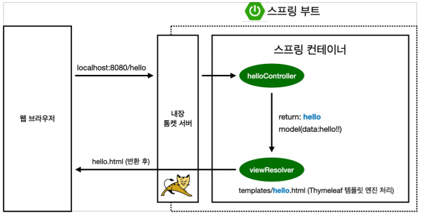

# Section 01. 프로젝트 환경 설정

## 1. 프로젝트 생성
### 1.1 사전 준비물
- Java 11
- IDE : IntelliJ 또는 Eclipse
### 1.2 스프링 프로젝트 생성
- [스프링 부트 스타터 사이트](https://start.spring.io/)에서 설정 후 받아서 적용
- Gradle, Java11, 안정적으로 release 된 최신 버전 SpringBoot, Spring Web 라이브러리, Thymeleaf 라이브러리

### 2.1 스프링부트 라이브러리

- spring-boot-starter-web
    - spring-boot-starter-tomcat: 톰캣 (웹서버)
    - spring-webmvc: 스프링 웹 MVC
- spring-boot-starter-thymeleaf: 타임리프 템플릿 엔진(View)
- spring-boot-starter(공통): 스프링 부트 + 스프링 코어 + 로깅
    - spring-boot
        - spring-core
- spring-boot-starter-logging
    - logback, slf4j

### 2.2 테스트 라이브러리

- spring-boot-starter-test
    - junit: 테스트 프레임워크
    - mockito: 목 라이브러리
    - assertj: 테스트 코드를 좀 더 편하게 작성하게 도와주는 라이브러리
    - spring-test: 스프링 통합 테스트 지원

## 3. View 환경 설정

### 3.1 Welcome Page 만들기
Spring Boot 가 실행될 때 index.html 을 먼저 찾는 데, 이 때 index.html 이 Welcome Page 
```html
<!DOCTYPE HTML>
<html>
<head>
    <title>Hello</title>
    <meta http-equiv="Content-Type" content="text/html; charset=UTF-8"/>
</head>
<body>
Hello
<a href="/hello">hello</a>
</body>
</html>
```

### 3.2 thymeleaf 템플릿 엔진
controller 폴더 생성 후 그 안에 code 입력

참고로, 여기서 controller 는 MVC 의 controller 이며, 코드 안 Model 은 MVC model

```java
// Controller 사용 시 @Controller 애노테이션을 추가해야 함
@Controller
public class HelloController {

    // 웹 애플리케이션 /hello 요청이 들어오면 아래 method 호출
    @GetMapping("hello")
    public String hello(Model model){
        model.addAttribute("data", "hello!");
        return "hello";
    }
}
```
위 java 코드의 /hello 요청 시 전달되는 hello.html
```html
<!DOCTYPE HTML>
<!--thymeleaf 템플릿 엔진이 선언되어 있어 thymeleaf 문법 사용 가능-->
<html xmlns:th="http://www.thymeleaf.org">
<head>
  <title>Hello</title>
  <meta http-equiv="Content-Type" content="text/html; charset=UTF-8" />
</head>
<body>
<p th:text="'안녕하세요. ' + ${data}" >안녕하세요. 손님</p>
</body>
</html>
```
#### thymeleaf 템플릿 동작 환경

1. `/hello` 가 들어오면 내장 톰캣 서버에서 `helloController` 로 전달
2. 컨트롤러는 hello를 mapping 시킬 수 있는지 확인 후, mapping 가능하면 실행
3. Model에  `data` 를 넣고 return 시킴 ⇒ thymeleaf 템플릿 엔진이 처리
4. 컨트롤러에서 리턴 값으로 문자를 반환하면 뷰 리졸버( viewResolver )가 화면을 찾아서 처리
    - 스프링 부트 템플릿엔진 기본 viewName 매핑
    - resources:templates/ + `{ViewName}` + .html

## 4. 빌드하고 실행하기
```shell
# Build 시키는 방법
## 해당 디렉토리로 이동 후
## windows는 gradlew.bat, Mac은 gradlew

./gradlew.bat build

## build 되고 나면 build/libs 안에 .jar 파일이 생성된 것을 확인 가능

# Run 시키는 방법
## java -jar {jar 파일명}
java -jar hello-spring-0.0.1-SNAPSHOT.jar
```