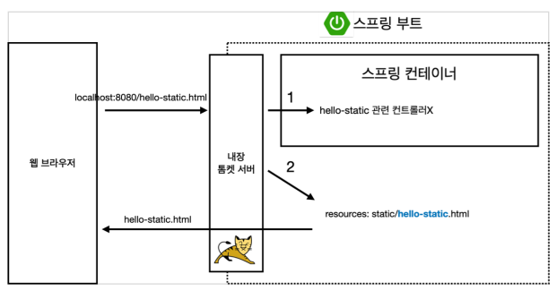
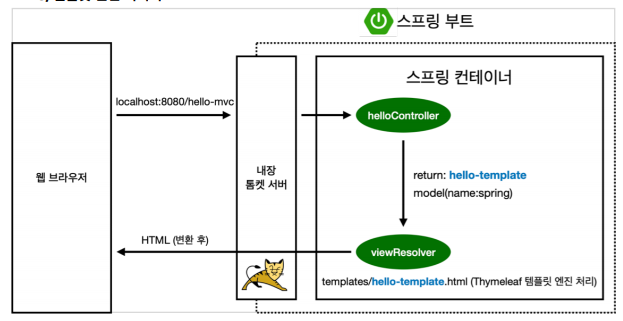
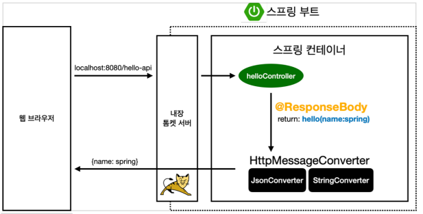

# Section 02. 스프링 웹 개발 기초

## 1. 정적 컨텐츠

### 1.1 정적 컨텐츠 만들기

아래와 같이 코드를 작성하고 http://localhost:8080/hello-static.html 로 접속하면 내용 확인 가능

 ```html
<!DOCTYPE HTML>
<html>
<head>
  <title>static content</title>
  <meta http-equiv="Content-Type" content="text/html; charset=UTF-8" />
</head>
<body>
정적 컨텐츠 입니다.
</body>
</html>
```

### 1.2 정적컨텐츠 원리

요청에 대해서 컨트롤러를 먼저 확인한 후 static 폴더 내에서 hello-static.html을 찾음



## 2. MVC와 템플릿 엔진

> 📌 MVC : Model, View, Controller

### 2.1 MVC 확인하기
Controller
```java
// Controller 사용 시 @Controller라고 Annotation을 추가해야 함
@Controller
public class HelloController {

    // 웹 애플리케이션에서 /hello 라고 들어오면 아래 method를 호출
    @GetMapping("hello")
    public String hello(Model model){
        model.addAttribute("data", "hello!");
        return "hello";
    }

    // MVC를 위해 추가
    @GetMapping("hello-mvc")
    public String helloMvc(@RequestParam("name") String name, Model model) {
        model.addAttribute("name", name);
        return "hello-template";
    }
}
```
View
```html
<html xmlns:th="http://www.thymeleaf.org">
<body>
  <p th:text="'hello ' + ${name}">hello! empty</p>
</body>
</html>
```

### 2.2 MVC, 템플릿 엔진

parameter가 추가된 것 빼고는 거의 동일한 형태


## 3. API
### 3.1 문자 반환 및 객체 반환
```java
@Controller
public class HelloController {

    // 웹 애플리케이션에서 /hello 라고 들어오면 아래 method 호출
    @GetMapping("hello")
    public String hello(Model model){
        model.addAttribute("data", "hello!");
        return "hello";
    }

    // MVC를 위해 추가
    @GetMapping("hello-mvc")
    public String helloMvc(@RequestParam("name") String name, Model model) {
        model.addAttribute("name", name);
        return "hello-template";
    }

    // API 테스트 - @ResponseBody 문자 반환
    @GetMapping("hello-string")
    @ResponseBody // 중요!! http의 body에 해당 데이터를 직접 넣겠다는 의미
    public String helloString(@RequestParam("name") String name){
        return "hello" + name; // name을 kim이라 하면 "hello kim"이 뜸
    }

    // API 테스트 - @ResponseBody 객체 반환
    // 데이터 전송 - JSON 형태(key-value)로 전송함
    @GetMapping("hello-api")
    @ResponseBody
    public Hello helloApi(@RequestParam("name") String name) {
        Hello hello = new Hello();
        hello.setName(name);
        return hello; // 객체 반환
    }

    // API 방식을 위해서는 get, set 사용
    static class Hello{
        private String name; // key

        public String getName() {
            return name;
        }

        public void setName(String name) {
            this.name = name;
        }
    }
}
```

### 3.2 사용 원리

- `@ResponseBody` 를 사용하여 API 생성<br/>
- HTTP의 BODY에 응답을 넣는 형태인데, 문자가 반환되는 경우 그대로 body에 넣고 객체가 반환되는 경우 JSON 형태로 body에 넣음
- viewReslover 대신에 HttpMessageConverter가 동작
    - 기본 문자 처리 : StringHttpMessageConverter
    - 기본 객체 처리 : MappingJackson2HttpMessageConverter
    - byte 처리 등등 기타 여러 HttpMessageConverter가 기본으로 등록되어 있음

> 👉 클라이언트의 HTTP Accept 헤더와 서버의 컨트롤러 반환 타입 정보 둘을 조합해서 HttpMessageConverter가 선택됨. 더 자세한 내용은 스프링 MVC 강의에서 설명.
