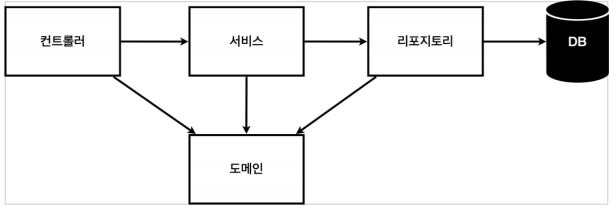
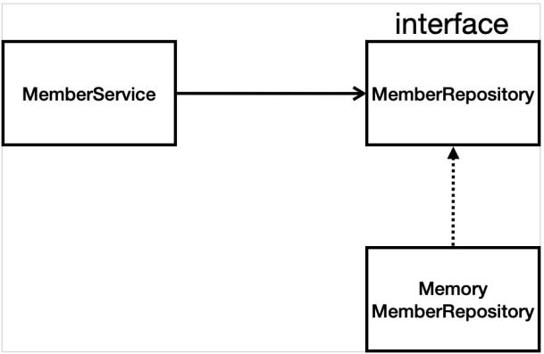

# Section 03. 회원 관리 예제 - 백엔드 개발

## 1. 비즈니스 요구사항 정리
- 데이터 : 회원ID, 이름
- 기능 : 회원 등록, 조회
- 아직 데이터 저장소가 선정되지 않음 (가상의 시나리오)

### 1.1 일반적인 웹 애플리케이션 계층 구조

- 컨트롤러 : 웹 MVC의 컨트롤러 역할
- 서비스 : 핵심 비즈니스 로직 구현 (회원은 중복 가입이 안된다 등)
- 리포지토리 : DB에 접근, 도메인 객체를 DB에 저장하고 관리
- 도메인 : 비즈니스 도메인 객체. 예) 회원, 주문, 쿠폰 등 주로 DB에 저장하고 관리됨

### 1.2 클래스 의존관계

- 아직 데이터 저장소가 선정되지 않아서, 우선 `인터페이스`로 구현 클래스를 변경할 수 있도록 설계<br/>
  ⇒ 개발은 해야하므로 Memory 모드로 단순한 구현체로 개발 (구체적인 기술 선정 후 바꾸기 위해 인터페이스를 사용)
- 데이터 저장소는 RDB, NoSQL 등등 다양한 저장소를 고민 중인 상황으로 가정
- 개발을 진행하기 위해서 초기 개발 단계에서는 구현체로 가벼운 메모리 기반의 데이터 저장소 사용

## 2. 회원 도메인과 리포지토리 만들기

### 2.1 회원 객체
```java
public class Member {

    private Long id; // 시스템이 저장하는 ID
    private String name; // 회원 이름

    // 단순하게 쉬운 예제로 하기 위해 getter, setter 사용
    public Long getId() {
        return id;
    }

    public void setId(Long id) {
        this.id = id;
    }

    public String getName() {
        return name;
    }

    public void setName(String name) {
        this.name = name;
    }
}
```

### 2.2 회원 리포지토리 인터페이스
```java
public interface MemberRepository {
    Member save(Member member);
    Optional<Member> findById(Long id);
    Optional<Member> findByName(String name);
    List<Member> findAll();

}
```

### 2.3 회원 리포지토리 메모리 구현체
```java
public class MemoryMemberRepository implements MemberRepository {

    // 실무에서는 동시성 문제 때문에 보통 ConcurrentHashMap을 사용하지만, 단순 예제이므로 HashMap 사용
    private static Map<Long, Member> store = new HashMap<>();
    // sequence는 0, 1, 2 이렇게 key 값을 생성해주는 역할.
    // 동시성 문제를 고려하면 AtomicLong을 사용하는 것이 좋지만 단순 예제이므로 long 사용
    private static long sequence = 0L;

    @Override
    public Member save(Member member) {
        member.setId(++sequence);
        store.put(member.getId(), member);
        return member;
    }

    @Override
    public Optional<Member> findById(Long id) {
        return Optional.ofNullable(store.get(id));
    }

    @Override
    public Optional<Member> findByName(String name) {
        return store.values().stream()
                .filter(member -> member.getName().equals(name)) // 파라미터로 넘어온 name이 getName과 같은 경우 필터
                .findAny(); // 하나라도 존재하면 반환, 없으면 Optional에 null 추가하여 반환
    }

    @Override
    public List<Member> findAll() {
        return new ArrayList<>(store.values());
    }
}
```

## 3. 회원 리포지토리 테스트 케이스 작성

- 개발한 기능을 실행해서 테스트 할 때 자바의 main 메서드를 통해서 실행하거나, 웹 애플리케이션의 컨트롤러를 통해서 해당 기능 실행<br/>⇒ 준비 및 실행이 오래 걸리고, 반복 실행 및 여러 테스트 한 번에 실행이 어려움
- JUnit이라는 프레임워크로 테스트를 실행하여 위의 문제 해결 가능
- Test 메소드들은 의존 관계를 가지면 fail되므로 아래와 같은 clear 코드가 필요
```java
// store를 비우는 용도로 사용
public class MemoryMemberRepository implements MemberRepository {
    // ...
    public void clearStore() {
      store.clear();
    }
}
```
테스트 코드
```java
// 다른 곳에서 사용하지 않기 때문에 public으로 하지 않아도 됨
class MemoryMemberRepositoryTest {

    MemoryMemberRepository repository = new MemoryMemberRepository();

    // @AfterEach : 동작이 끝날 때마다 실행
    @AfterEach
    public void afterEach(){
        // Test 메소드들이 의존 관계가 생기지 않도록 store 비워주기
        repository.clearStore();
    }
    
    @Test
    public void save(){
        Member member = new Member();
        member.setName("spring");

        repository.save(member);

        Member result = repository.findById(member.getId()).get();
        
        // 출력 통해 가져온 정보(result)와 member가 같은지 확인 가능
        // System.out.println("result= " + (result == member));
      
        // 출력을 통한 방법은 번거롭기 때문에 주로 assert 사용
        // Assertions.assertEquals(member, result); // 기대한 값, 가져온 값
      
        // 최근에 가장 많이 사용하는 방법
        // Assertions.assertThat(member).isEqualTo(result);
      
        // Assertions를 import 했기 때문에 아래와 같이 그냥 사용 가능
        assertThat(member).isEqualTo(result);
    }

    @Test
    public void findByName(){
        Member member1 = new Member();
        member1.setName("spring1");
        repository.save(member1);
        
        Member member2 = new Member();
        member2.setName("spring2");
        repository.save(member2);

        Member result = repository.findByName("spring1").get();
        assertThat(result).isEqualTo(member1);


    }

    @Test
    public void findAll(){
        Member member1 = new Member();
        member1.setName("spring1");
        repository.save(member1);

        Member member2 = new Member();
        member2.setName("spring2");
        repository.save(member2);

        List<Member>  result = repository.findAll();

        assertThat(result.size()).isEqualTo(2);
    }
}
```

## 4. 회원 서비스 개발

- 서비스 클래스는 비즈니스에 가까운 이름을 선택, 리포지토리는 단순한 이름으로 선택 (일반적)
```java
public class MemberService {

    private final MemberRepository memberRepository = new MemoryMemberRepository();

    // 회원가입
    public Long join(Member member) {

        // 같은 이름이 있는 중복 회원 X
        // Optional<Member> result = memberRepository.findByName(member.getName());
        // 이름이 있는 경우
        // result.ifPresent(m -> {
        //     throw new IllegalStateException("이미 존재하는 회원입니다.");
        // });


        // 코드를 더 보기 좋은 형태로 수정
        // memberRepository.findByName(member.getName())
        //         .ifPresent(m -> {throw new IllegalStateException("이미 존재하는 회원입니다.");});

        validateDuplicateMember(member); // 중복 회원 검증

        memberRepository.save(member);
        return member.getId();
    }

    // 기능을 메서드로 분리
    private void validateDuplicateMember(Member member) {
        memberRepository.findByName(member.getName())
                .ifPresent(m -> {throw new IllegalStateException("이미 존재하는 회원입니다.");});
    }

    // 전체 회원 조회
    public List<Member> findMembers() {
        return memberRepository.findAll();
    }

    public Optional<Member> findOne(Long memberId) {
        return memberRepository.findById(memberId);
    }
}
```

## 5. 회원 서비스 테스트

- 테스트 생성 단축키 `ctrl + shift + t` 를 통해 테스트 자동 생성 가능
- test 디렉토리 내 같은 이름의 패키지에 `{기존 클래스명} + Test` 형태로 테스트 클래스가 생성
- 아래와 같이 클래스 껍데기만 존재하므로 내용을 추가하여 Test를 진행하면 됨
```java
class MemberServiceTest {

    @Test
    void join() {
    }

    @Test
    void findMembers() {
    }

    @Test
    void findOne() {
    }
}
```
- MemberService에서 MemberRepository를 사용하는 형태로 쓰기 때문에 이런 경우에는 외부에서 가져오는 형태로 사용하는 것이 좋음
```java
public class MemberService {
    // ...
  
    // 직접 생성하는 형태에서 외부에서 가져오는 형태로 변경
    private final MemberRepository memberRepository;

    public MemberService(MemberRepository memberRepository){
      this.memberRepository = memberRepository;
    }
}
```
- Test 코드
```java
class MemberServiceTest {

    // MemberService memberService = new MemberService();
    // MemoryMemberRepository memberRepository = new MemoryMemberRepository();

    // 같은 메모리 멤버 리포지토리를 사용하는 형태로 변경
    MemberService memberService;
    MemoryMemberRepository memberRepository;

    // @BeforeEach : 동작 전에 실행되는 메소드
    @BeforeEach
    public void beforeEach(){
        memberRepository =  new MemoryMemberRepository();
        memberService = new MemberService(memberRepository);
    }

    // @AfterEach : 동작이 끝날 때마다 실행되는 메소드
    @AfterEach
    public void afterEach(){
        memberRepository.clearStore();
    }

    @Test
    void join() {

        // Test 코드를 작성할 때 given-when-then 형태로 만들면 알아보기 더 쉬움
        // 상황에 따라 변형을 하는 형태로 만들면 됨

        // given
        Member member = new Member();
        member.setName("spring");

        // when
        Long saveId = memberService.join(member);

        // then
        Member findMember = memberService.findOne(saveId).get();
        assertThat(member.getName()).isEqualTo(findMember.getName());
    }

    @Test
    // 테스트코드의 클래스명은 실제 코드에 포함되지 않으므로 한글로 작성해도 상관 X
    public void 중복회원예외(){
        // given
        Member member1 = new Member();
        member1.setName("spring");

        Member member2 = new Member();
        member2.setName("spring");


        // when
        memberService.join(member1);
        // assertThrows(IllegalStateException.class, () -> memberService.join(member2));
        IllegalStateException e = assertThrows(IllegalStateException.class, () -> memberService.join(member2));
        assertThat(e.getMessage()).isEqualTo("이미 존재하는 회원입니다.");
    }

    @Test
    void findMembers() {
    }

    @Test
    void findOne() {
    }
}
```