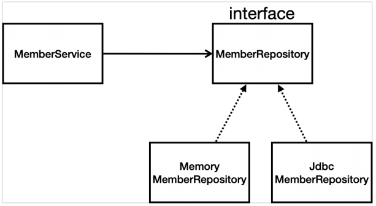
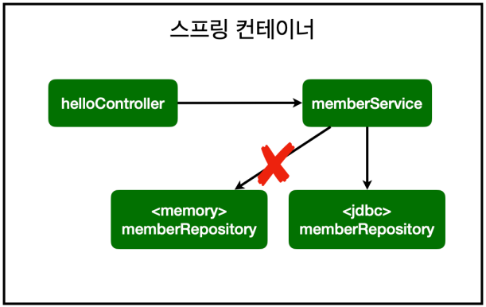
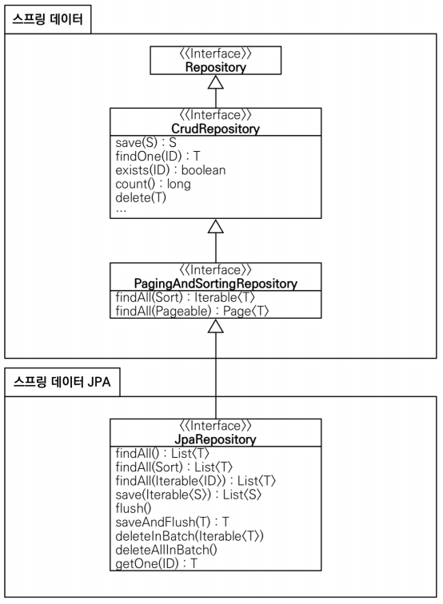

# Section 6. 스프링 DB 접근 기술

## 1. H2 데이터베이스

### H2란?

- 주로 개발이나 테스트 용도로 사용하는 가볍고 편리한 DB
- 웹 화면을 제공함
- [H2 Database Engine](https://www.h2database.com/html/main.html)

### H2 데이터베이스 설치

강의 참고하기 🥰🥰

### H2 콘솔에서 데이터 베이스 생성

테이블 생성

```h2
drop table if exists member CASCADE; // 처음 생성에서는 필요 X
create table member
(
    id   bigint generated by default as identity, // java에서는 long이 sql에서는bigint
    name varchar(255),
    primary key (id)
);
```

데이터 추가

```h2
INSERT INTO MEMBER (NAME)
VALUES ('spring')
INSERT INTO MEMBER (NAME)
VALUES ('spring2')
INSERT INTO MEMBER (NAME)
VALUES ('spring2')
```

## 2. 순수 JDBC

> 예전에 많이 쓰던 방식으로, 과거에는 이렇게 했구나 정도로 듣고 넘겨도 된다고 함

### 환경 설정

- `build.gradle` 파일에 jdbc, h2 데이터베이스 관련 라이브러리 추가

```shell
// DB랑 붙으려면 jdbc 드라이버 꼭 필요
implementation 'org.springframework.boot:spring-boot-starter-jdbc'
// DB랑 붙을 때 데이터베이스가 제공하는 클라이언트 필요
runtimeOnly 'com.h2database:h2'
```

- `resources/application.properties` 에 경로를 추가하여 스프링부트 데이터베이스 연결 <br/>
  ⇒ gradle을 reload하면 h2.Driver가 정상적으로 import됨

```shell
spring.datasource.url=jdbc:h2:tcp://localhost/~/{내 DB URL}
spring.datasource.driver-class-name=org.h2.Driver
```

### JDBC 리포지토리 구현

JDBC 회원 리포지토리

```java
public class JdbcMemberRepository implements MemberRepository {
    // DB에 붙으려면 DataSource 필요, 스프링으로부터 주입받아야 함
    private final DataSource dataSource;

    // 스프링한테 주입 받는 부분
    public JdbcMemberRepository(DataSource dataSource) {
        this.dataSource = dataSource;
    }

    @Override
    public Member save(Member member) {
        // ? 위치에 파라미터 바인딩한 값이 들어감
        String sql = "insert into member(name) values(?)";
        Connection conn = null;
        PreparedStatement pstmt = null;
        ResultSet rs = null; // 결과를 받는 부분
        try {
            // DB conntection을 가져오는 부분
            conn = getConnection();
            // insert문에 대해서만 키 자동 생성
            pstmt = conn.prepareStatement(sql,
                    Statement.RETURN_GENERATED_KEYS);
            // 값을 넣는 부분
            pstmt.setString(1, member.getName());
            // DB에 실제 쿼리가 반영되는 부분
            pstmt.executeUpdate();
            // RETURN_GENERATED_KEYS로 자동 생성된 키를 반환
            rs = pstmt.getGeneratedKeys();
            // 값이 존재하는 경우 꺼내고 없는 경우 exception 처리
            if (rs.next()) {
                member.setId(rs.getLong(1));
            } else {
                throw new SQLException("id 조회 실패");
            }
            // return을 해주지 않으면 connection만 엄청 쌓이게 되므로 반드시 return을 통한 release를 해줘야함 (장애 발생 가능성이 있음)
            return member;
        } catch (Exception e) {
            throw new IllegalStateException(e);
        } finally {
            // 사용한 자원에 대해서 close 해야함
            close(conn, pstmt, rs);
        }
    }

    @Override
    public Optional<Member> findById(Long id) {
        String sql = "select * from member where id = ?";
        Connection conn = null;
        PreparedStatement pstmt = null;
        ResultSet rs = null;
        try {
            conn = getConnection();
            pstmt = conn.prepareStatement(sql);
            pstmt.setLong(1, id);
            // 쿼리를 통해 조회한 내용을 가져오는 부분
            rs = pstmt.executeQuery();
            // 값을 반환하는 부분
            if (rs.next()) {
                Member member = new Member();
                member.setId(rs.getLong("id"));
                member.setName(rs.getString("name"));
                return Optional.of(member);
            } else {
                return Optional.empty();
            }
        } catch (Exception e) {
            throw new IllegalStateException(e);
        } finally {
            close(conn, pstmt, rs);
        }
    }

    @Override
    public List<Member> findAll() {
        String sql = "select * from member";
        Connection conn = null;
        PreparedStatement pstmt = null;
        ResultSet rs = null;
        try {
            conn = getConnection();
            pstmt = conn.prepareStatement(sql);
            rs = pstmt.executeQuery();
            // 모든 정보를 찾아오므로 list에 넣음
            List<Member> members = new ArrayList<>();
            while (rs.next()) {
                Member member = new Member();
                member.setId(rs.getLong("id"));
                member.setName(rs.getString("name"));
                members.add(member);
            }
            return members;
        } catch (Exception e) {
            throw new IllegalStateException(e);
        } finally {
            close(conn, pstmt, rs);
        }
    }

    @Override
    public Optional<Member> findByName(String name) {
        String sql = "select * from member where name = ?";
        Connection conn = null;
        PreparedStatement pstmt = null;
        ResultSet rs = null;
        try {
            conn = getConnection();
            pstmt = conn.prepareStatement(sql);
            pstmt.setString(1, name);
            rs = pstmt.executeQuery();
            if (rs.next()) {
                Member member = new Member();
                member.setId(rs.getLong("id"));
                member.setName(rs.getString("name"));
                return Optional.of(member);
            }
            return Optional.empty();
        } catch (Exception e) {
            throw new IllegalStateException(e);
        } finally {
            close(conn, pstmt, rs);
        }
    }

    private Connection getConnection() {
        return DataSourceUtils.getConnection(dataSource);
    }

    // close 과정이 복잡하구나 라는 정도로만 알고 넘어가도 됨
    private void close(Connection conn, PreparedStatement pstmt, ResultSet rs) {
        try {
            if (rs != null) {
                rs.close();
            }
        } catch (SQLException e) {
            e.printStackTrace();
        }
        try {
            if (pstmt != null) {
                pstmt.close();
            }
        } catch (SQLException e) {
            e.printStackTrace();
        }
        try {
            if (conn != null) {
                close(conn);
            }
        } catch (SQLException e) {
            e.printStackTrace();
        }
    }

    private void close(Connection conn) throws SQLException {
        DataSourceUtils.releaseConnection(conn, dataSource);
    }
}
```

configuration 을 생성해야 사용할 수 있으므로 SpringConfig 파일을 수정하여 스프링 설정 변경

```java
// 자바 코드로 직접 스프링 빈 등록하기
@Configuration
public class SpringConfig {

    private DataSource dataSource;

    @Autowired
    public SpringConfig(DataSource dataSource){
        this.dataSource = dataSource;
    }

    @Bean
    public MemberService memberService() {
        return new MemberService(memberRepository());
    }

    @Bean
    public MemberRepository memberRepository() {
//        return new MemoryMemberRepository();
        return new JdbcMemberRepository(dataSource);
    }
}
```

### 구현 클래스 구조
MemberService 는 MemberRepository 를 의존하고 있는 형태이며,
MemberRepository 는 구현체로 MemoryMemberRepository 와 JdbcMemberRepository 를 가지고 있음



연결을 memory 에서 jdbc 로 변경하였을 뿐 그 외에 바뀐 것은 없음



스프링 DI 를 사용하면 기존 코드를 전혀 손대지 않고, 설정만으로 구현 클래스를 변경할 수 있다. (연결만 변경)

⇒ 개방-폐쇄 원칙 (OCP, Open-Closed Principle) : 확장에는 열려있고, 수정/변경에는 닫혀 있음

## 3. 스프링 통합 테스트

스프링 컨테이너와 DB 를 연결하여 통합 테스트 진행

### 회원가입 테스트
```java
@SpringBootTest // 스프링 컨테이너와 테스트를 함께 실행
class MemberServiceIntegrationTest {

    // 테스트의 경우 가장 편한 방법으로 진행하는 것이 더 좋으므로 바로 @Autowired 하는 것이 나음
    @Autowired MemberService memberService;
    @Autowired MemberRepository memberRepository;

    @Test
    void 회원가입() {
        // given
        Member member = new Member();
        member.setName("spring");
        // when
        Long saveId = memberService.join(member);
        // then
        Member findMember = memberService.findOne(saveId).get();
        assertThat(member.getName()).isEqualTo(findMember.getName());
    }
}
```
테스트가 정상 작동하면 DB 에 member 가 추가된 것을 확인할 수 있다.
그렇기에 테스트 코드 재실행 시 IllegalStateException 이 발생한다.

이 문제를 해결하기 위해서는 DB 에 저장된 내용을 지워야 한다.
스프링에서는 `@Transactional` 이라는 애노테이션을 제공하는 데,
이는 테스트 시작 전 transaction 을 실행하고, 테스트가 끝난 후 rollback 함으로써 
DB에 데이터가 반영하지 않게 해준다.
```java
@SpringBootTest // 스프링 컨테이너와 테스트를 함께 실행
@Transactional // 테스트 케이스에 이 애노테이션이 있으면, 테스트 시작 전에 트랜잭션을 시작하고, 테스트 완료 후 항상 롤백 => DB에 데이터가 남지 않으므로 다음 테스트에 영향을 주지 않음
class MemberServiceIntegrationTest {

    // 테스트의 경우 가장 편한 방법으로 진행하는 것이 더 좋으므로 바로 @Autowired 하는 것이 나음
    @Autowired
    MemberService memberService;
    @Autowired MemberRepository memberRepository;

    @Test
    void 회원가입() {
        // given
        Member member = new Member();
        member.setName("spring");
        // when
        Long saveId = memberService.join(member);
        // then
        Member findMember = memberService.findOne(saveId).get();
        assertThat(member.getName()).isEqualTo(findMember.getName());
    }

}
```

## 4. 스프링 JDBC Template
순수 JDBC 와 동일한 환경 설정을 하면 되고, 스프링 JDBC Template, MyBatis 같은 라이브러리는 JDBC API에서 본 반복 코드를 대부분 제거해준다.
하지만 **SQL 은 직접 작성해야 한다.**
```java
public class JdbcTemplateMemberRepository implements MemberRepository{

    // JdbcTemplate를 사용할 때 권장하는 스타일--------------------
    private final JdbcTemplate jdbcTemplate;

    @Autowired // 생성자가 하나이므로 생략해도 괜찮음
    public JdbcTemplateMemberRepository(DataSource dataSource) {
        this.jdbcTemplate = new JdbcTemplate(dataSource);
    }
    //---------------------------------------------------------

    @Override
    public Member save(Member member) {
        // 쿼리를 짤 필요가 없는 형태 - 이렇게 하는구나! 라고만 알고 넘어가기
        SimpleJdbcInsert jdbcInsert = new SimpleJdbcInsert(jdbcTemplate);
        jdbcInsert.withTableName("member").usingGeneratedKeyColumns("id");
        Map<String, Object> parameters = new HashMap<>();
        parameters.put("name", member.getName());
        // 키를 받고 그 키를 setId해서 return하는 형태
        Number key = jdbcInsert.executeAndReturnKey(new MapSqlParameterSource(parameters));
        member.setId(key.longValue());
        return member;
    }

    // JDBC와 비교하면 코드가 단순해진 것을 알 수 있음
    @Override
    public Optional<Member> findById(Long id) {
        List<Member> result = jdbcTemplate.query("select * from member where id = ?", memberRowMapper(), id);
        return  result.stream().findAny();
    }

    @Override
    public Optional<Member> findByName(String name) {
        List<Member> result = jdbcTemplate.query("select * from member where name = ?", memberRowMapper(), name);
        return result.stream().findAny();
    }

    @Override
    public List<Member> findAll() {
        return jdbcTemplate.query("select * from member", memberRowMapper());
    }

    private RowMapper<Member> memberRowMapper() {
        return (rs, rowNum) -> {
            Member member = new Member();
            member.setId(rs.getLong("id"));
            member.setName(rs.getString("name"));
            return member;
        };
        /* 위의 람다 코드가 주석 처리한 코드와 같은 의미
        return new RowMapper<Member>(){
            @Override
            public Member mapRow(ResultSet rs, int rowNum) throws SQLException {
                Member member = new Member();
                member.setId(rs.getLong("id"));
                member.setName(rs.getString("name"));
                return member;
            }
        };
         */
    }
}
```
코드 작성을 완료하면 `Spring Config` 를 수정하여 JDBC Template 코드와 연결해준다.
```java
@Bean
public MemberRepository memberRepository() {
    return new JdbcTemplateMemberRepository(dataSource);
}
```
제대로 작동되는지 확인하기 위해 실행시켜야 하는데, 이전에 통합테스트를 위해 작성한 코드를 그대로 활용하자!

(테스트코드가 없다면 직접 회원가입을 해보고 목록을 확인해야 하지만, 테스트 코드로 인해 그 수고가 줄어들었다!)

## 5. JPA

JPA 는 기존의 반복 코드 뿐만 아니라 기본적인 SQL 도 직접 만들어서 실행해준다.
그러므로 SQL 과 데이터 중심의 설계에서 객체 중심의 설계로 패러다임을 전환할 수 있으며
개발 생산성 또한 크게 향상된다.

JPA를 쓰기 위해 먼저 build.gralde 을 수정하자! 수정 후 reload 해야 라이브러리를 다운 받는다.
`spring-boot-starter-data-jpa` 는 내부에 JDBC 관련 라이브러리를 포함한다.
```java
implementation 'org.springframework.boot:spring-boot-starter-data-jpa'
```
그 후 application.properties 에 JPA 관련 설정을 추가한다.
```shell
# JPA가 생성하는 sql을 볼 수 있음
spring.jpa.show-sql=true
# JPA를 사용하면 객체를 보고 자동으로 테이블을 생성하는데,
# 여기서는 이미 생성된 테이블을 사용할 예정이므로 테이블 자동 생성 기능을 끈다.
# none이 아닌 create를 사용하면 엔티티 정보를 바탕으로 테이블도 직접 생성해준다.
# 운영 환경 개발일 때는 테이블에 자동 생성되면 안되니 none 을 설정하는 것이 좋다.
spring.jpa.hibernate.ddl-auto=none
```
JPA 는 표준 인터페이스만 제공하고 구현체로 hibernate, eclipselink 등 여러 개의 구현 벤더들이 있다.
여기서는 hibernate 를 사용하며, Mapping 은 애노테이션을 이용한다.
JPA 사용 전, JPA 가 사용하는 Entity 를 알려주고 PK 를 설정해야 하므로 Member 코드를 아래와 같이 수정한다.

```java
@Entity // Entity 표시
public class Member {

    // PK 설정, DB가 알아서 생성해주는 것을 IDENTITY 라고 함
    @Id @GeneratedValue(strategy = GenerationType.IDENTITY)
    private Long id; // 시스템이 저장하는 ID

    // DB에 설정된 name이 username인 경우 @Column 애노테이션을 이용해 매핑시키면 됨
    // @Column(name = "username")
    private String name; // 회원 이름

    // 단순하게 쉬운 예제로 하기 위해 getter, setter 사용
    public Long getId() {
        return id;
    }

    public void setId(Long id) {
        this.id = id;
    }

    public String getName() {
        return name;
    }

    public void setName(String name) {
        this.name = name;
    }
```
JPA 를 사용하려면 `EntityManager` 를 주입해야 한다. JPA 를 사용하여 수정한 MemberRepository 코드는 아래와 같다.
```java
public class JpaMemberRepository implements MemberRepository{

    // JPA를 사용하려면 EntityManager를 주입받아야함! (이렇게 외워두세요 :D)
    private final EntityManager em;

    public JpaMemberRepository(EntityManager em) {
        this.em = em;
    }

    @Override
    public Member save(Member member) {
        // 이렇게 하면 JPA가 insert해서 id까지 다 넣어줌
        em.persist(member);
        return member;
    }

    @Override
    public Optional<Member> findById(Long id) {
        // find에 조회할 타입과 식별자(PK값)를 넣어주면 됨
        Member member = em.find(Member.class, id);
        return Optional.ofNullable(member);
    }

    @Override
    public Optional<Member> findByName(String name) {
        List<Member> result = em.createQuery("select m from Member m where m.name = :name", Member.class)
                .setParameter("name", name)
                .getResultList();
        return result.stream().findAny();
    }

    @Override
    public List<Member> findAll() {
        // jpqa 쿼리의 경우 객체(entity)를 대상으로 쿼리를 날림
        return em.createQuery("select m from Member m", Member.class)
                .getResultList();
    }
}
```
이렇게 수정한 코드와 서비스를 연결하기 위해서는 MemberService 코드에 @Transactional 어노테이션을 추가해야 한다.
JPA 는 모든 데이터 변경이 Transaction 안에서 실행되어야 하기 때문이다.
```java
@Transactional
public class MemberService {
    // ...
}
```
코드 실행을 위해 `SpringConfig` 를 수정해야 하는데, 여기서도 `EntityManager` 를 추가해야 한다
```java
@Configuration
public class SpringConfig {

    private EntityManager em;

    @Autowired
    public SpringConfig(EntityManager em) {
        this.em = em;
    }

    @Bean
    public MemberService memberService() {
        return new MemberService(memberRepository());
    }

    @Bean
    public MemberRepository memberRepository() {
        return new JpaMemberRepository(em);
    }
}
```
동작은 이전과 같이 테스트 코드를 사용하여 확인한다.
만약, DB에 잘 반영되었는지 확인하고 싶다면 코드에 @Commit 애노테이션만 추가하면 된다.
```java
@Test
@Commit
void 회원가입() {
    // given
    Member member = new Member();
    member.setName("spring");
    // when
    Long saveId = memberService.join(member);
    // then
    Member findMember = memberService.findOne(saveId).get();
    assertThat(member.getName()).isEqualTo(findMember.getName());
}
```

## 6. 스프링 데이터 JPA
스프링 부트와 JPA 만 사용해도 개발 생산성이 정말 많이 증가하고, 개발해야 할 코드도 확연히 줄어든다.
여기에 스프링 데이터 JPA 를 사용하면, 기존의 한계를 넘어 마치 마법처럼 리포지토리에 구현 클래스 없이 인터페이스만으로 개발을 완료할 수 있다.
그리고 **반복 개발해 온 기본 CRUD 기능도 스프링 데이터 JPA 가 모두 제공**한다.
그로 인해 개발자는 핵심 비즈니스 로직 개발에만 집중할 수 있게 된다.

### 스프링 데이터 JPA 구현
스프링 데이터 JPA 회원 리포지토리를 먼저 생성해보자.
인터페이스가 인터페이스를 상속 받을 때는 extends 를 사용하며, 인터페이스는 다중 상속이 가능하다.

```java
public interface SpringDataJpaMemberRepository extends JpaRepository<Member, Long>, MemberRepository {
    @Override
    Optional<Member> findByName(String name);
}
```

이렇게 작성하면 끝!!!

스프링 데이터 JPA 가 JPA 리포지토리를 상속 받으며 구현체를 자동으로 생성해주며 스프링 빈에 자동으로 등록해준다.
직접 스프링 빈에 등록할 필요 없이 그냥 스프링 데이터 JPA 가 생성해 준 빈을 가져다 쓰면 된다.

SpringConfig 코드를 아래와 같이 memberRepository 를 받아오는 형태로 수정한다.

```java
@Configuration
public class SpringConfig {

    private final MemberRepository memberRepository;

    @Autowired
    public SpringConfig(MemberRepository memberRepository) {
        this.memberRepository = memberRepository;
    }


    @Bean
    public MemberService memberService() {
        return new MemberService(memberRepository);
    }

}
```
해당 코드도 이전에 작성한 테스트 코드가 정상 동작한다!

### 스프링 데이터 JPA 제공 클래스

스프링 데이터 JPA 가 상속 받은 JPA 리포지토리를 확인해보면 기본 메서드에 대해 제공을 해주는 것을 확인할 수 있다.



스프링 데이터 JPA 가 제공하는 기능은 다음과 같다.
- 인터페이스를 통한 기본적인 CRUD
- `findByName()`, `findByEmail()`처럼 메서드 이름만으로 조회 기능 제공
- 페이징 기능 자동 제공

스프링 데이터 JPA 가 제공하는 두 번째 기능에 대해서 의문이 들 수도 있으니 자세히 설명하자면,

```java
@Override
Optional<Member> findByName(String name);
```

위와 같은 형태로 코드를 작성한 경우 스프링 데이터 JPA 에서 아래와 같은 형태로 JPQL 을 짠다.

```sql
select m from Member m where m.name = ?
```

이렇게 스프링 데이터 JPA 를 활용하면 인터페이스 만으로 간단한 부분에 대해서 다 만들 수 있다는 장점이 있다.
그리고 JPA 만으로는 복잡한 동적 쿼리 구현이 어렵지만, Querydsl 이라는 라이브러리를 사용하여 이 문제를 해결할 수 있다.
이 조합으로도 해결하기 어려운 쿼리는 JPA 가 제공하는 네이티브 쿼리를 사용하거나, JdbcTemplate 를 사용하면 된다.
그리고 JPA 와 MyBatis 를 섞어 쓸 수도 있다.