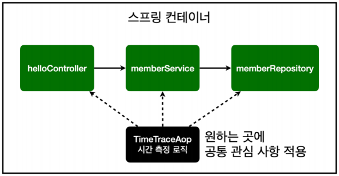
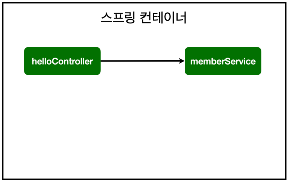
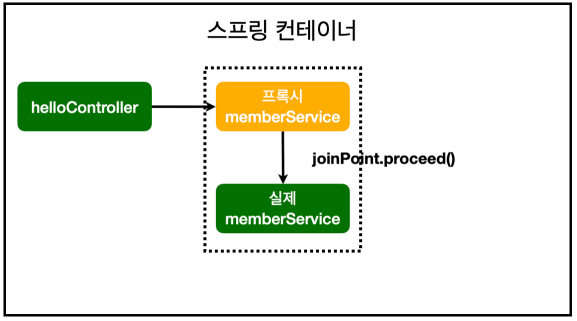
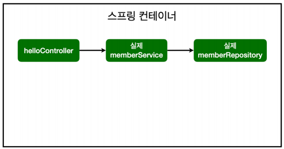
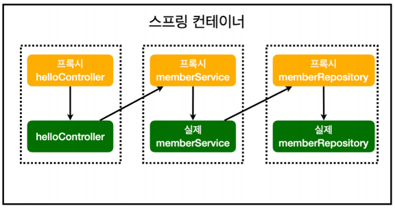

# Section 7. AOP (Aspect Oriented Programming)

## 1. AOP 가 필요한 상황

> 일반적으로 여러 메서드의 호출 시간을 측정할 때 사용한다.

회원 가입 시간과 회원 조회 시간을 측정하려고 할 때, 아래와 같이 호출 시간과 로직이 끝났을 때의 시간을 비교하여 시간을 측정할 수 있다.

```java
@Transactional
public class MemberService {

    private final MemberRepository memberRepository;

    public MemberService(MemberRepository memberRepository){
        this.memberRepository = memberRepository;
    }

    // 회원가입
    public Long join(Member member) {

        // 호출 시간 측정
        long start = System.currentTimeMillis();

        // 로직이 끝날 때의 시간을 찍어야 함
        try {
            validateDuplicateMember(member); // 중복 회원 검증

            memberRepository.save(member);
            return member.getId();
        } finally {
            long finish = System.currentTimeMillis();
            long timeMs = finish - start; // 호출 시간 계산
            System.out.println("join = " + timeMs + "ms");
        }
    }

    private void validateDuplicateMember(Member member) {
        memberRepository.findByName(member.getName())
                .ifPresent(m -> {
                    throw new IllegalStateException("이미 존재하는 회원입니다.");
                });
    }

    // 전체 회원 조회
    public List<Member> findMembers() {
        long start = System.currentTimeMillis();
        try {
            return memberRepository.findAll();
        } finally {
            long finish = System.currentTimeMillis();
            long timeMs = finish - start; // 호출 시간 계산
            System.out.println("findMembers = " + timeMs + "ms");
        }
    }

    public Optional<Member> findOne(Long memberId) {
        return memberRepository.findById(memberId);
    }
}
```

**여기서 문제는?!**
- 회원 가입, 회원 조회 시간을 측정하는 기능은 핵심 관심 사항이 아니다. (핵심 관심 사항은 비즈니스 로직)
- 시간 측정 로직은 공통 관심 사항이다.
- 시간 측정 로직과 핵심 비즈니스 로직이 섞여 유지보수가 어렵다.
- 시간 측정 로직을 별로 공통 로직으로 만들기 매우 어렵다.
- 시간 측정 로직을 변경할 때 모든 로직을 찾아가며 변경해야 한다.


## 2. AOP 적용

### AOP 적용

AOP 는 공통 관심 사항 (cross-cutting concern) 과 핵심 관심 사항 (core concern) 을 분리하는 역할을 한다.
아래와 같이 시간 측정 로직을 한 군데 모으고, 여기서 원하는 곳에 공통 관심 사항을 적용하는 형태로 구현이 가능하다는 의미이다.



시간 측정 코드를 직접 작성해보려 한다. 여기서 주의할 점은 AOP 사용을 위해서 @Aspect 애노테이션을 추가해야 한다는 점이다.
```java
@Aspect
public class TimeTraceAop {
    public Object execute(ProceedingJoinPoint joinPoint) throws Throwable {
        long start = System.currentTimeMillis();
        System.out.println("START: " + joinPoint.toString());
        try {
            return joinPoint.proceed(); // 다음 메서드로 진행
        } finally {
            long finish = System.currentTimeMillis();
            long timeMs = finish - start;
            System.out.println("END: " + joinPoint.toString()+ " " + timeMs + "ms");
        }
    }
}
```

@Component 애노테이션을 통해 등록 후 사용해도 되긴 하지만 아래와 같이 스프링 빈에 등록하여 사용하는 것이 더 좋다!

```java
@Bean
public TimeTraceAop timeTraceAop(){
    return new TimeTraceAop();
}
```

그렇지만 여기서는 @Component 를 사용하는 형태로 작성했다.

```java
@Component
@Aspect
public class TimeTraceAop {
    public Object execute(ProceedingJoinPoint joinPoint) throws Throwable {
        // ...
    }
}
```

그리고 @Around 애노테이션을 적용한다. @Around 애노테이션은 지정된 패턴에 해당하는 메서드 실행 전/후 모두 동작한다.

사용할 때 패키지명, 클래스명, 파라미터명 등 원하는 조건에 맞춰 넣으면 된다.
여기서는 패키지 하위에 모두 적용하는 형태로 작성한다.

```java
public class TimeTraceAop {
    @Around("execution(* hello.hellospring..*(..))")
    public Object execute(ProceedingJoinPoint joinPoint) throws Throwable {
        // ...
    }
}
```

만약 패키지 안에 있는 서비스만 측정하고 싶다면 아래와 같은 형식으로 쓰면 된다.

```java
@Around("execution(* hello.hellospring.service..*(..))")
```

위 내용에 대한 최종 코드는 다음과 같다.

```java
@Component
@Aspect
public class TimeTraceAop {
    @Around("execution(* hello.hellospring..*(..))")
    public Object execute(ProceedingJoinPoint joinPoint) throws Throwable {
        long start = System.currentTimeMillis();
        System.out.println("START: " + joinPoint.toString());
        try {
            return joinPoint.proceed();
        } finally {
            long finish = System.currentTimeMillis();
            long timeMs = finish - start;
            System.out.println("END: " + joinPoint.toString()+ " " + timeMs + "ms");
        }
    }
}
```

이 과정을 통해 위해서 발생했던 문제들을 해결할 수 있다.
- 회원 가입, 회원 조회 등 핵심 관심 사항과 시간을 측정하는 공통 관심 사항을 분리한다.
- 시간 측정 로직을 별도의 공통 로직으로 만든다.
- 핵심 관심 사항을 깔끔하게 유지할 수 있다.
- 변경이 필요하면 이 로직만 변경하면 된다.
- 원하는 적용 대상을 선택할 수 있다.

### 스프링 AOP 동작 방식 설명

AOP 적용 전 의존 관계



AOP 적용 후 의존 관계<br/>
⇒ 프록시라고 하는 가짜 스프링 빈을 앞에 세워 놓고 컨트롤러와 연결하며, joinPoint.proceed()를 통해 진짜 서비스에 연결



AOP 적용 전 전체 그림



AOP 적용 후 전체 그림

