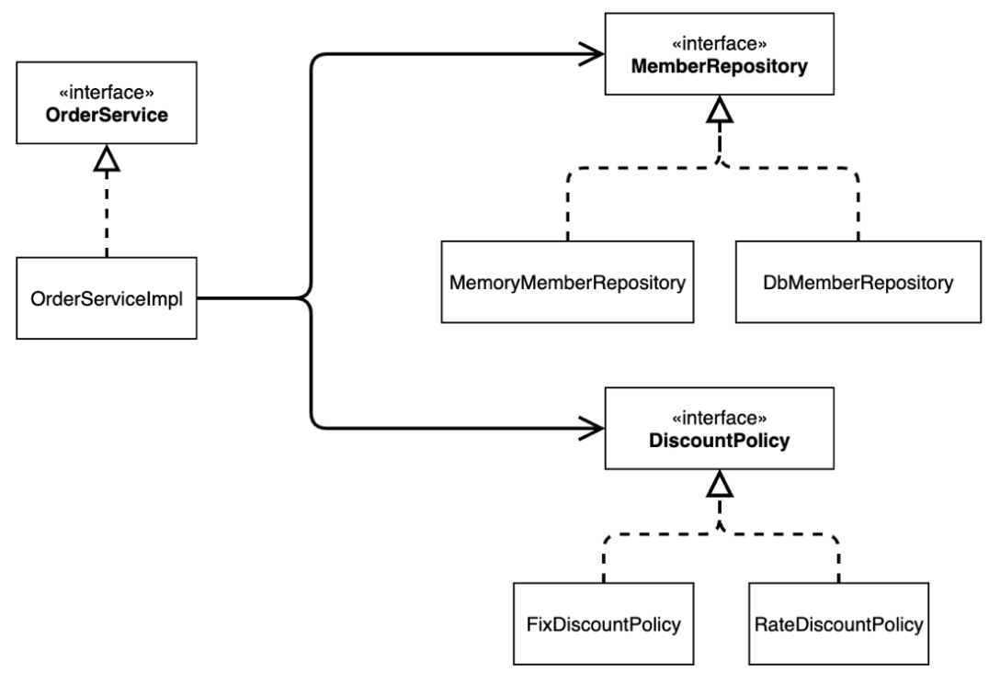
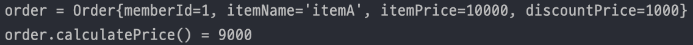

# Section 02. 스프링 핵심 원리 이해1 - 예제 만들기

## 1. 프로젝트 생성
### 환경
- Java 11
- Spring Boot 2.7.4
- Gradle
- Packaging : Jar
- IDE : IntelliJ
### IntelliJ Gradle 대신 자바 직접 실행 설정
- 최근 IntelliJ 버전은 Gradle 을 통해서 실행하는 것이 기본 설정 ⇒ 실행 속도가 느림
- 아래와 같이 변경하면 자바로 바로 실행해서 속도가 더 빠름
  <br/>

## 2. 비즈니스 요구사항과 설계
### 회원
- 회원 가입하고 조회할 수 있음
- 일반과 VIP 두 가지 등급이 있음
- 회원 데이터는 자체 DB를 구축할 수 있고, 외부 시스템과 연동할 수 있음
### 주문과 할인 정책
- 회원은 상품 주문 가능
- 회원 등급에 따른 할인 정책 적용
  - 모든 VIP는 1000원 할인하는 고정 금액 할인 적용
- 할인 정책은 변경 가능성이 높음
  - 기본 할인 정책을 정하지 않았고, 오픈 직전까지 미루고 싶어하는 상황

## 3. 회원 도메인 설계
### 회원 도메인 협력 관계
- 회원 DB는 아직 확정된 상태가 아니기 때문에 회원 저장소 구현체가 3개로 나뉘어짐
- 메모리 회원 저장소로 선개발 진행 (재부팅 시 모든 데이터 사라짐)

### 회원 클래스 다이어그램
- 회원 서비스 역할을 MemberService 라는 인터페이스로 생성하고, MemberServiceImpl 로 구현
- MemberRepository 가 회원 저장소에 대한 역할이며, 그에 대한 구현체가 MemoryMemberRepository, DbMemberRepository 등이 있음

### 회원 객체 다이어그램
- 객체 간의 참조를 나타낸 다이어그램
- 여기서 회원 서비스는 MemberServiceImpl


## 4. 회원 도메인 개발
### 파일 구조

### 회원 등급
```java
public enum Gradle {
    BASIC,
    VIP
}
```
### 회원 엔티티
```java
@Getter
@Setter
public class Member {
    private Long id;
    private String name;
    private Gradle gradle;
    
    pubilc Member(Long id, String name, Gradle gradle) {
        this.id = id;
        this.name = name;
        this.gradle = gradle;
    }
}
```
### 회원 저장소 인터페이스
```java
public interface MemberRepository {
    void save(Member member);
    Member findById(Long memberId);
}
```
### 회원 저장소 구현체
데이터베이스가 아직 확정된 상태가 아니므로 메모리 회원 저장소 사용
```java
public class MemoryMemberRepository implements MemberRepository {

  private static Map<Long, Member> store = new HashMap<>(); // 실무에서는 ConcurrentHashMap 을 사용하는 게 좋음

  @Override
  public void save(Member member) {
    store.put(member.getId(), member);
  }

  @Override
  public Member findById(Long memberId) {
    return store.get(memberId);
  }
}
```
### 회원 인터페이스 
```java
public interface MemberService {
    void join(Member member);
    Member findMember(Long memberId);
}
```
### 회원 서비스 구현체
보통 서비스 구현에서는 `Impl`을 붙여 구현체로 나타내는 관습이 있음
```java
public class MemberServiceImpl implements MemberService{

    private final MemberRepository memberRepository = new MemoryMemberRepository();

    @Override
    public void join(Member member) {
        memberRepository.save(member);
    }

    @Override
    public Member findMember(Long memberId) {
        return memberRepository.findById(memberId);
    }
}
```

## 5. 회원 도메인 실행과 테스트
### 회원 도메인 - 회원 가입 main
```java
public class MemberApp {
    public static void main(String[] args) {
        MemberService memberService = new MemberServiceImpl();
        Member member = new Member(1L, "memberA", Grade.VIP);
        memberService.join(member);

        Member findMember = memberService.findMember(1L);
        System.out.println("member = " + member.getName());
        System.out.println("findMember = " + findMember.getName());
    }
}
```

코드를 실행시켜 보면 member와 findMember가 동일함을 확인할 수 있음.

여기서는 순수 Java 코드만 사용했으며, Spring 활용은 하지 않음.


그러나 이렇게 애플리케이션 로직을 테스트하는 것은 좋은 방법이 아님.
⇒ JUnit 테스트를 사용하자

### 회원 도메인 - 회원 가입 테스트
JUnit 테스트를 활용해 테스트 코드를 작성하면 콘솔을 통해 문제점을 더 빠르게 확인할 수 있기 때문에 테스트 코드를 작성하는 것은 매우 중요함!!
```java
import org.assertj.core.api.Assertions;
import org.junit.jupiter.api.Test;

public class MemberServiceTest {

    MemberService memberService = new MemberServiceImpl();

    @Test
    void join() {
        // given
        Member member = new Member(1L, "memberA", Grade.VIP);

        // when
        memberService.join(member);
        Member findMember = memberService.findMember(1L);

        // then
        Assertions.assertThat(member).isEqualTo(findMember);
    }
}
```
### 회원 도메인 설계의 문제점
회원 도메인은 인터페이스 뿐만 아니라 구현까지 모두 의존하고 있음 ⇒ DIP 위반

## 6. 주문과 할인 도메인 설계
### 주문 도메인 협력, 역할, 책임


1. 주문 생성 : 클라이언트는 주문 서비스에 주문 생성 요청
2. 회원 조회 : 할인을 위해 회원 등급 필요 → 주문 서비스는 회원 저장소에서 회원 조회
3. 할인 적용 : 주문 서비스는 회원 등급에 따른 할인 여부를 할인 정책에 위임
4. 주문 결과 반환 : 주문 서비스는 할인 결과를 포함한 주문 결과 반환

> 실제로는 주문 데이터를 DB에 저장하는 과정도 있지만, 여기서는 예제가 너무 복잡해질 수 있으므로 생략한다고 함!

### 주문 도메인 전체
역할과 구현을 분리해서 자유롭게 구현 객체를 조립할 수 있게 설계
⇒ 회원 저장소는 물론, 할인 정책도 유연하게 변경 가능


### 주문 도메인 클래스 다이어그램



### 주문 도메인 객체 다이어그램 1
회원을 메모리에서 조회하고, 정액 할인 정책을 지원해도 주문 서비스는 변경하지 않아도 되며, 역할들의 협력 관계를 그대로 재사용 가능


### 주문 도메인 객체 다이어그램 2
회원을 메모리가 아닌 실제 DB에서 조회하고, 정률 할인 정책을 지원해도 주문 서비스는 변경하지 않아도 되며, 협력 관계 재사용 가능


## 7. 주문과 할인 도메인 개발
### 파일 구조


### 할인 정책 인터페이스
```java
public interface DiscountPolicy {
    /**
     * @return 할인 대사 금액
     */
    int discount(Member member, int price);
}
```

### 정액 할인 정책 구현체
```java
public class FixDiscountPolicy implements DiscountPolicy{

    private int discountFixAmount = 1000; // 1000원 할인으로 고정

    @Override
    public int discount(Member member, int price) {
        if (member.getGrade() == Grade.VIP) {
            return discountFixAmount;
        } else {
            return 0;
        }
    }
}
```

### 주문 엔티티
```java
@Getter
@Setter
public class Order {
    private Long memberId;
    private String itemName;
    private int itemPrice;
    private int discountPrice;

    public Order(Long memberId, String itemName, int itemPrice, int discountPrice) {
        this.memberId = memberId;
        this.itemName = itemName;
        this.itemPrice = itemPrice;
        this.discountPrice = discountPrice;
    }

    // 비즈니스 로직 - 계산 로직
    public int calculatePrice() {
        return itemPrice - discountPrice;
    }

    // 출력을 위해 toString 생성
    @Override
    public String toString() {
        return "Order{" +
                "memberId=" + memberId +
                ", itemName='" + itemName + '\'' +
                ", itemPrice=" + itemPrice +
                ", discountPrice=" + discountPrice +
                '}';
    }
}
```

### 주문 서비스 인터페이스
```java
public interface OrderService {
    Order createOrder(Long memberId, String itemName, int itemPrice);
}
```

### 주문 서비스 구현체

주문 서비스에서는 할인 정책에 대해 정확하게 알 수 없으며, 할인에 대한 책임은 DiscountPolicy에 전가함 ⇒ SRP를 잘 지킴!!

```java
public class OrderServiceImpl implements OrderService{

    private final MemberRepository memberRepository = new MemoryMemberRepository();
    private final DiscountPolicy discountPolicy = new FixDiscountPolicy();

    @Override
    public Order createOrder(Long memberId, String itemName, int itemPrice) {
        Member member = memberRepository.findById(memberId);
        int discountPrice = discountPolicy.discount(member, itemPrice); // 할인에 대한 책임을 discountPolicy 에 전가 => SRP 를 잘 지킴
        return new Order(memberId, itemName, itemPrice, discountPrice);
    }
}
```

## 8. 주문과 할인 도메인 실행과 테스트

### 주문과 할인 정책 실행

```java
public class OrderApp {
    public static void main(String[] args) {
        MemberService memberService = new MemberServiceImpl();
        OrderService orderService = new OrderServiceImpl();

        Long memberId = 1L;
        Member member = new Member(memberId, "memberA", Grade.VIP);
        memberService.join(member);

        Order order = orderService.createOrder(memberId, "itemA", 10000);
        System.out.println("order = " + order);
        System.out.println("order.calculatePrice() = " + order.calculatePrice());
    }
}
```

실행 결과 할인된 금액이 잘 출력되는 것을 확인할 수 있음. 이전에도 얘기했듯 애플리케이션 로직으로 테스트하는 것은 좋은 방법이 아니니 JUnit 테스트를 사용하자



### 주문과 할인 정책 테스트

```java
public class OrderServiceTest {
    MemberService memberService = new MemberServiceImpl();
    OrderService orderService = new OrderServiceImpl();

    @Test
    void createOrder() {
        Long memberId = 1L;
        Member member = new Member(memberId, "memberA", Grade.VIP);
        memberService.join(member);

        Order order = orderService.createOrder(memberId, "itemA", 10000);
        Assertions.assertThat(order.getDiscountPrice()).isEqualTo(1000);
    }
}
```